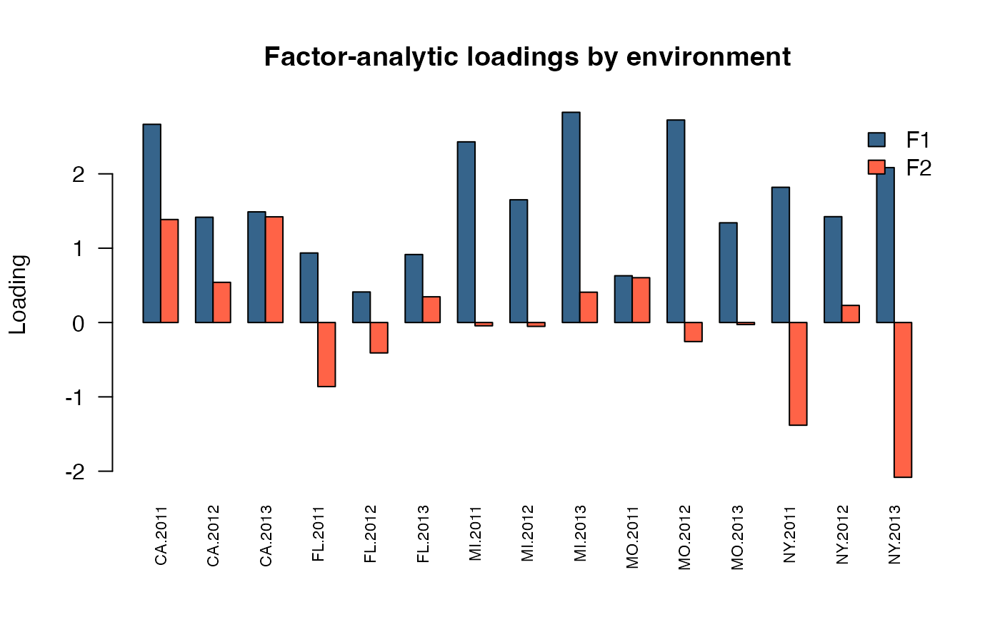

# Factor analytic and reduced rank models in sommer

The sommer package was developed to provide R users with a flexible
univariate and multivariate linear mixed-model solver. Multi-environment
trial (MET) analyses often need a genetic covariance structure among
environments. A fully unstructured covariance
([`usm()`](https://covaruber.github.io/sommer/reference/usm.md))
captures every pairwise environment relationship but requires
$`q(q+1)/2-1`$ parameters for $`q`$ environments, which quickly becomes
difficult to estimate reliably as the number of environments grows.
Factor-analytic (FA) and reduced-rank (RR) models approximate that same
covariance with far fewer parameters by assuming that
genotype-by-environment interaction is driven by a small number of
latent factors.

This vignette focuses on the
[`fam()`](https://covaruber.github.io/sommer/reference/fam.md) and
[`rrcm()`](https://covaruber.github.io/sommer/reference/rrcm.md)
covariance-shaping factors used inside
[`vsm()`](https://covaruber.github.io/sommer/reference/vsm.md), and on
the
[`loadings_mmes()`](https://covaruber.github.io/sommer/reference/loadings_mmes.md)/[`scores_mmes()`](https://covaruber.github.io/sommer/reference/scores_mmes.md)
helper functions used to extract and visualize their fitted quantities.

**SECTION 1: Theory**

1.  Why reduce the cross-environment covariance
2.  The factor-analytic (FA) model
3.  The reduced-rank (RR) model
4.  Choosing k and comparing to other structures

**SECTION 2: Fitting factor-analytic and reduced-rank models**

1.  Data
2.  Factor-analytic model with
    [`fam()`](https://covaruber.github.io/sommer/reference/fam.md)
3.  Reduced-rank model with
    [`rrcm()`](https://covaruber.github.io/sommer/reference/rrcm.md)
4.  Comparing FA and RR

**SECTION 3: Extracting loadings, scores, and diagnostic plots**

1.  Loadings and specific variances
2.  Genotype scores
3.  Percentage of variance explained
4.  Loadings plot
5.  Genotype scores biplot
6.  Heatmap of the fitted genetic correlation matrix

## SECTION 1: Theory

### 1) Why reduce the cross-environment covariance

Let $`q`$ be the number of environments and $`G`$ the $`q\times q`$
genetic covariance matrix among them. An unstructured model estimates
every variance and covariance directly, $`q(q+1)/2-1`$ working
parameters after removing the single overall scale owned by
[`vsm()`](https://covaruber.github.io/sommer/reference/vsm.md). As $`q`$
grows, this saturated model becomes weakly identified relative to the
available genotype replication, and its estimates become unstable.
Diagonal
([`dsm()`](https://covaruber.github.io/sommer/reference/dsm.md)) and
compound-symmetry
([`csm()`](https://covaruber.github.io/sommer/reference/csm.md)) models
are far more parsimonious but assume, respectively, no genetic
correlation among environments or one common correlation everywhere.
Factor-analytic and reduced-rank models sit between these extremes: they
estimate genuine environment-specific covariance patterns while
controlling the number of parameters through a rank $`k \ll q`$.

### 2) The factor-analytic (FA) model

The FA model represents the environment covariance shape as

``` math

K = \Lambda\Lambda^{\mathsf T} + \Psi,
```

where $`\Lambda`$ is a $`q\times k`$ loading matrix and $`\Psi`$ is a
diagonal matrix of environment-specific variances. Each environment’s
genetic variance is split into a part explained by the $`k`$ common
latent factors ($`\Lambda\Lambda^{\mathsf T}`$) and a part unique to
that environment ($`\Psi`$).
[`vsm()`](https://covaruber.github.io/sommer/reference/vsm.md) still
owns the single overall variance scale, so `fam(x, k)` reports a
normalized shape with $`K_{11}=1`$; the number of estimated working
parameters for $`k`$ factors and $`q`$ environments is

``` math

kq-\frac{k(k-1)}{2} + (q-1),
```

the first term for the (rotationally-constrained, lower-triangular)
loadings and the second for the environment-specific variance ratios.

### 3) The reduced-rank (RR) model

The RR model uses the same loading structure but fixes the
environment-specific remainder to be homogeneous:

``` math

K = \Lambda\Lambda^{\mathsf T} + I.
```

`rrcm(x, k)` therefore has

``` math

kq-\frac{k(k-1)}{2}
```

working parameters: exactly $`q-1`$ fewer than `fam(x, k)`, because it
does not estimate separate environment-specific variances. RR is a
restricted (nested) special case of FA in which every environment is
assumed to have the same residual/specific variance after accounting for
the $`k`$ common factors. It is useful when there is not enough
replication to support $`q`$ separate specific variances, or as a more
parsimonious first approximation before fitting the full FA model.

### 4) Choosing k and comparing to other structures

Increasing $`k`$ moves the model continuously from compound
symmetry-like behavior ($`k=0`$, not directly supported, but
conceptually the limit) toward the saturated unstructured model
($`k=q-1`$). In practice $`k`$ is chosen small enough to remain
identifiable and interpretable (often 1-3 factors), and increased only
if it meaningfully improves the likelihood. Because RR is nested inside
FA with the same $`k`$,
[`anova.mmes()`](https://covaruber.github.io/sommer/reference/anova_mmes.md)
can be used to test whether the extra $`q-1`$ FA specific-variance
parameters are supported by the data.

## SECTION 2: Fitting factor-analytic and reduced-rank models

### 1) Data

We use the `DT_h2` multi-environment potato yield dataset, which has 15
environments (`Env`, combining location and year) and 41 genotypes
(`Name`).

``` r
library(sommer)
```

    ## Loading required package: Matrix

    ## Loading required package: MASS

    ## Loading required package: crayon

    ## Loading required package: enhancer

``` r
data(DT_h2, package="enhancer")
DT <- DT_h2
DT <- DT[with(DT, order(Env)), ]
length(unique(DT$Env))
```

    ## [1] 15

``` r
length(unique(DT$Name))
```

    ## [1] 41

``` r
head(DT)
```

    ##          Name     Env Loc Year     Block  y
    ## 67   MSL007-B CA.2011  CA 2011 CA.2011.2  5
    ## 105  MSL007-B CA.2011  CA 2011 CA.2011.1  6
    ## 308  MSK061-4 CA.2011  CA 2011 CA.2011.2  9
    ## 393  MSK061-4 CA.2011  CA 2011 CA.2011.1 10
    ## 469 MSR169-8Y CA.2011  CA 2011 CA.2011.1 11
    ## 471     NY148 CA.2011  CA 2011 CA.2011.1 11

### 2) Factor-analytic model with `fam()`

``` r
fitFA <- mmes(y ~ Env,
              random = ~ vsm(fam(Env, 2), ism(Name)),
              rcov = ~ units,
              nIters = 150, verbose = FALSE,
              data = DT)
```

    ## Solver selected: ldlt

``` r
summary(fitFA)$varcomp
```

    ##                           term factor                  parameter      estimate
    ## 1  vsm(fam(Env, 2), ism(Name))     fa        loading[CA.2011,F1]  3.0046519693
    ## 2  vsm(fam(Env, 2), ism(Name))     fa        loading[CA.2012,F1]  1.5060193694
    ## 3  vsm(fam(Env, 2), ism(Name))     fa        loading[CA.2013,F1]  1.9765890147
    ## 4  vsm(fam(Env, 2), ism(Name))     fa        loading[FL.2011,F1]  0.4327513625
    ## 5  vsm(fam(Env, 2), ism(Name))     fa        loading[FL.2012,F1]  0.1762433429
    ## 6  vsm(fam(Env, 2), ism(Name))     fa        loading[FL.2013,F1]  0.9712471982
    ## 7  vsm(fam(Env, 2), ism(Name))     fa        loading[MI.2011,F1]  2.1362610328
    ## 8  vsm(fam(Env, 2), ism(Name))     fa        loading[MI.2012,F1]  1.4410339019
    ## 9  vsm(fam(Env, 2), ism(Name))     fa        loading[MI.2013,F1]  2.6972962978
    ## 10 vsm(fam(Env, 2), ism(Name))     fa        loading[MO.2011,F1]  0.8361967123
    ## 11 vsm(fam(Env, 2), ism(Name))     fa        loading[MO.2012,F1]  2.2991867809
    ## 12 vsm(fam(Env, 2), ism(Name))     fa        loading[MO.2013,F1]  1.1777648240
    ## 13 vsm(fam(Env, 2), ism(Name))     fa        loading[NY.2011,F1]  0.9770960169
    ## 14 vsm(fam(Env, 2), ism(Name))     fa        loading[NY.2012,F1]  1.3695063236
    ## 15 vsm(fam(Env, 2), ism(Name))     fa        loading[NY.2013,F1]  0.8890331795
    ## 16 vsm(fam(Env, 2), ism(Name))     fa        loading[CA.2012,F2]  0.1733638045
    ## 17 vsm(fam(Env, 2), ism(Name))     fa        loading[CA.2013,F2] -0.5753080098
    ## 18 vsm(fam(Env, 2), ism(Name))     fa        loading[FL.2011,F2]  1.1958463443
    ## 19 vsm(fam(Env, 2), ism(Name))     fa        loading[FL.2012,F2]  0.5523615628
    ## 20 vsm(fam(Env, 2), ism(Name))     fa        loading[FL.2013,F2]  0.1147705678
    ## 21 vsm(fam(Env, 2), ism(Name))     fa        loading[MI.2011,F2]  1.1597749640
    ## 22 vsm(fam(Env, 2), ism(Name))     fa        loading[MI.2012,F2]  0.8073819646
    ## 23 vsm(fam(Env, 2), ism(Name))     fa        loading[MI.2013,F2]  0.9421242225
    ## 24 vsm(fam(Env, 2), ism(Name))     fa        loading[MO.2011,F2] -0.2448474486
    ## 25 vsm(fam(Env, 2), ism(Name))     fa        loading[MO.2012,F2]  1.4835249937
    ## 26 vsm(fam(Env, 2), ism(Name))     fa        loading[MO.2013,F2]  0.6426967739
    ## 27 vsm(fam(Env, 2), ism(Name))     fa        loading[NY.2011,F2]  2.0648636207
    ## 28 vsm(fam(Env, 2), ism(Name))     fa        loading[NY.2012,F2]  0.4524597868
    ## 29 vsm(fam(Env, 2), ism(Name))     fa        loading[NY.2013,F2]  2.8085407257
    ## 30 vsm(fam(Env, 2), ism(Name))     fa specific_variance[CA.2011]  6.6632027594
    ## 31 vsm(fam(Env, 2), ism(Name))     fa specific_variance[CA.2012]  3.0472827397
    ## 32 vsm(fam(Env, 2), ism(Name))     fa specific_variance[CA.2013]  3.6124438637
    ## 33 vsm(fam(Env, 2), ism(Name))     fa specific_variance[FL.2011]  0.0508478108
    ## 34 vsm(fam(Env, 2), ism(Name))     fa specific_variance[FL.2012]  0.0001836361
    ## 35 vsm(fam(Env, 2), ism(Name))     fa specific_variance[FL.2013]  0.0001659060
    ## 36 vsm(fam(Env, 2), ism(Name))     fa specific_variance[MI.2011]  3.0531255671
    ## 37 vsm(fam(Env, 2), ism(Name))     fa specific_variance[MI.2012]  2.3170425642
    ## 38 vsm(fam(Env, 2), ism(Name))     fa specific_variance[MI.2013] 11.2709597520
    ## 39 vsm(fam(Env, 2), ism(Name))     fa specific_variance[MO.2011]  0.0002067681
    ## 40 vsm(fam(Env, 2), ism(Name))     fa specific_variance[MO.2012]  9.0140947799
    ## 41 vsm(fam(Env, 2), ism(Name))     fa specific_variance[MO.2013]  0.0270998954
    ## 42 vsm(fam(Env, 2), ism(Name))     fa specific_variance[NY.2011]  0.0003465884
    ## 43 vsm(fam(Env, 2), ism(Name))     fa specific_variance[NY.2012]  0.0003229576
    ## 44 vsm(fam(Env, 2), ism(Name))     fa specific_variance[NY.2013]  0.3821381921
    ## 45             vsm(ism(units)) sigma2                     sigma2  3.9687347977
    ##        StdError      Zratio
    ## 1  0.4812859559  6.24296623
    ## 2  0.3235430791  4.65477232
    ## 3  0.3977827445  4.96901649
    ## 4  0.3309592041  1.30756709
    ## 5  0.2181785448  0.80779411
    ## 6  0.2507143110  3.87392006
    ## 7  0.5183320053  4.12141448
    ## 8  0.3278907097  4.39486042
    ## 9  0.6252856346  4.31370265
    ## 10 0.2691060856  3.10731253
    ## 11 0.5849889705  3.93030791
    ## 12 0.2466671497  4.77471291
    ## 13 0.4844438907  2.01694362
    ## 14 0.2244530298  6.10152745
    ## 15 0.5776411754  1.53907515
    ## 16 0.4104203429  0.42240549
    ## 17 0.5213065419 -1.10358870
    ## 18 0.3188515393  3.75048007
    ## 19 0.2066366275  2.67310578
    ## 20 0.3280556909  0.34985087
    ## 21 0.5381212174  2.15522995
    ## 22 0.3544931897  2.27756693
    ## 23 0.7297398317  1.29104125
    ## 24 0.3274506805 -0.74773840
    ## 25 0.6537251353  2.26934060
    ## 26 0.2962785986  2.16923118
    ## 27 0.3687470536  5.59967490
    ## 28 0.2942352818  1.53774824
    ## 29 0.4146274045  6.77364954
    ## 30 1.7247107218  3.86337412
    ## 31 0.9384560442  3.24712357
    ## 32 1.3146082061  2.74792432
    ## 33 0.5467695913  0.09299678
    ## 34 0.0010612855  0.17303180
    ## 35 0.0009588206  0.17303138
    ## 36 1.4162533552  2.15577641
    ## 37 0.7755660077  2.98755044
    ## 38 2.7452616187  4.10560497
    ## 39 0.0011949774  0.17303097
    ## 40 2.3225036609  3.88119723
    ## 41 0.4136514530  0.06551384
    ## 42 0.0020030379  0.17303136
    ## 43 0.0018664397  0.17303403
    ## 44 1.2149576840  0.31452798
    ## 45 0.1716324787 23.12344859

### 3) Reduced-rank model with `rrcm()`

``` r
fitRR <- mmes(y ~ Env,
              random = ~ vsm(rrcm(Env, 2), ism(Name)),
              rcov = ~ units,
              nIters = 150, verbose = FALSE,
              data = DT)
```

    ## Solver selected: ldlt

``` r
summary(fitRR)$varcomp
```

    ##                            term factor                parameter    estimate
    ## 1  vsm(rrcm(Env, 2), ism(Name))     rr      loading[CA.2011,F1]  3.39046616
    ## 2  vsm(rrcm(Env, 2), ism(Name))     rr      loading[CA.2012,F1]  1.50769301
    ## 3  vsm(rrcm(Env, 2), ism(Name))     rr      loading[CA.2013,F1]  1.73699068
    ## 4  vsm(rrcm(Env, 2), ism(Name))     rr      loading[FL.2011,F1]  0.59674581
    ## 5  vsm(rrcm(Env, 2), ism(Name))     rr      loading[FL.2012,F1]  0.27538637
    ## 6  vsm(rrcm(Env, 2), ism(Name))     rr      loading[FL.2013,F1]  0.72682397
    ## 7  vsm(rrcm(Env, 2), ism(Name))     rr      loading[MI.2011,F1]  2.53302873
    ## 8  vsm(rrcm(Env, 2), ism(Name))     rr      loading[MI.2012,F1]  1.58481366
    ## 9  vsm(rrcm(Env, 2), ism(Name))     rr      loading[MI.2013,F1]  3.59721792
    ## 10 vsm(rrcm(Env, 2), ism(Name))     rr      loading[MO.2011,F1]  0.84339674
    ## 11 vsm(rrcm(Env, 2), ism(Name))     rr      loading[MO.2012,F1]  3.00738952
    ## 12 vsm(rrcm(Env, 2), ism(Name))     rr      loading[MO.2013,F1]  1.25703474
    ## 13 vsm(rrcm(Env, 2), ism(Name))     rr      loading[NY.2011,F1]  1.82343227
    ## 14 vsm(rrcm(Env, 2), ism(Name))     rr      loading[NY.2012,F1]  1.24762170
    ## 15 vsm(rrcm(Env, 2), ism(Name))     rr      loading[NY.2013,F1]  1.60626434
    ## 16 vsm(rrcm(Env, 2), ism(Name))     rr      loading[CA.2012,F2]  0.48918153
    ## 17 vsm(rrcm(Env, 2), ism(Name))     rr      loading[CA.2013,F2] -1.32604766
    ## 18 vsm(rrcm(Env, 2), ism(Name))     rr      loading[FL.2011,F2]  0.74768031
    ## 19 vsm(rrcm(Env, 2), ism(Name))     rr      loading[FL.2012,F2]  0.25002863
    ## 20 vsm(rrcm(Env, 2), ism(Name))     rr      loading[FL.2013,F2]  0.35353424
    ## 21 vsm(rrcm(Env, 2), ism(Name))     rr      loading[MI.2011,F2]  1.12513389
    ## 22 vsm(rrcm(Env, 2), ism(Name))     rr      loading[MI.2012,F2]  0.48254139
    ## 23 vsm(rrcm(Env, 2), ism(Name))     rr      loading[MI.2013,F2] -1.51313837
    ## 24 vsm(rrcm(Env, 2), ism(Name))     rr      loading[MO.2011,F2] -0.04115861
    ## 25 vsm(rrcm(Env, 2), ism(Name))     rr      loading[MO.2012,F2]  2.50009018
    ## 26 vsm(rrcm(Env, 2), ism(Name))     rr      loading[MO.2013,F2] -0.15937520
    ## 27 vsm(rrcm(Env, 2), ism(Name))     rr      loading[NY.2011,F2]  1.66324240
    ## 28 vsm(rrcm(Env, 2), ism(Name))     rr      loading[NY.2012,F2]  0.30614965
    ## 29 vsm(rrcm(Env, 2), ism(Name))     rr      loading[NY.2013,F2]  1.29290596
    ## 30 vsm(rrcm(Env, 2), ism(Name))     rr common_specific_variance  1.76788204
    ## 31              vsm(ism(units)) sigma2                   sigma2  4.24056224
    ##     StdError      Zratio
    ## 1  0.3436971  9.86469144
    ## 2  0.2675313  5.63557621
    ## 3  0.3384232  5.13259997
    ## 4  0.3826875  1.55935525
    ## 5  0.2853064  0.96523033
    ## 6  0.3589753  2.02471871
    ## 7  0.4309543  5.87771948
    ## 8  0.2717983  5.83084416
    ## 9  0.4282884  8.39905564
    ## 10 0.3994517  2.11138630
    ## 11 0.5008905  6.00408604
    ## 12 0.3093412  4.06358627
    ## 13 0.5207888  3.50128909
    ## 14 0.2852322  4.37405573
    ## 15 0.3294797  4.87515410
    ## 16 0.3179273  1.53865838
    ## 17 0.3608453 -3.67483745
    ## 18 0.4074074  1.83521543
    ## 19 0.3289056  0.76018347
    ## 20 0.4945683  0.71483406
    ## 21 0.4033748  2.78930167
    ## 22 0.2967954  1.62583864
    ## 23 0.4352931 -3.47613698
    ## 24 0.4274046 -0.09629893
    ## 25 0.4542493  5.50378465
    ## 26 0.3707700 -0.42984917
    ## 27 0.4567274  3.64165263
    ## 28 0.3290315  0.93045693
    ## 29 0.3314473  3.90078843
    ## 30 0.2239370  7.89455218
    ## 31 0.2034219 20.84614409

### 4) Comparing FA and RR

Because `rrcm(Env, 2)` is nested inside `fam(Env, 2)` (both use rank 2,
but RR fixes the specific variances to be equal), we can compare them
with a likelihood ratio test:

``` r
c(AIC_FA = fitFA$AIC, AIC_RR = fitRR$AIC)
```

    ##     AIC_FA     AIC_RR 
    ## -144.60404  -72.58775

``` r
anova.mmes(fitFA, fitRR)
```

    ## Likelihood ratio test for mixed models
    ## ==============================================================
    ##      Df        AIC        BIC    loLik    Chisq ChiDf                  PrChisq
    ## mod1 60 -144.60404 -73.042200 87.30202                                        
    ## mod2 46  -72.58775  -1.025909 51.29387 72.01629    14 8.30643229326153e-10 ***
    ## ==============================================================
    ## Signif. codes:  0 '***' 0.001 '**' 0.01 '*' 0.05 '.' 0.1 ' ' 1

    ##      Df        AIC        BIC    loLik    Chisq ChiDf                  PrChisq
    ## mod1 60 -144.60404 -73.042200 87.30202                                        
    ## mod2 46  -72.58775  -1.025909 51.29387 72.01629    14 8.30643229326153e-10 ***

A lower AIC/BIC and a significant likelihood ratio test favor the less
restrictive FA model whenever the data support heterogeneous
environment-specific variances.

## SECTION 3: Extracting loadings, scores, and diagnostic plots

### 1) Loadings and specific variances

[`loadings_mmes()`](https://covaruber.github.io/sommer/reference/loadings_mmes.md)
reconstructs the fitted, normalized loadings $`\Lambda`$ and specific
variances $`\Psi`$ so that $`\sigma^2(\Lambda\Lambda^{\mathsf T}+\Psi)`$
reproduces the fitted covariance matrix exactly.

``` r
faInfo <- loadings_mmes(fitFA)
round(faInfo$loadings, 3)
```

    ##            F1     F2
    ## CA.2011 2.666  1.386
    ## CA.2012 1.416  0.541
    ## CA.2013 1.489  1.422
    ## FL.2011 0.935 -0.862
    ## FL.2012 0.411 -0.409
    ## FL.2013 0.915  0.346
    ## MI.2011 2.430 -0.044
    ## MI.2012 1.651 -0.052
    ## MI.2013 2.828  0.408
    ## MO.2011 0.629  0.603
    ## MO.2012 2.724 -0.256
    ## MO.2013 1.341 -0.027
    ## NY.2011 1.819 -1.382
    ## NY.2012 1.424  0.230
    ## NY.2013 2.084 -2.082

``` r
round(faInfo$specific, 3)
```

    ## CA.2011 CA.2012 CA.2013 FL.2011 FL.2012 FL.2013 MI.2011 MI.2012 MI.2013 MO.2011 
    ##   1.682   0.769   0.912   0.013   0.000   0.000   0.771   0.585   2.845   0.000 
    ## MO.2012 MO.2013 NY.2011 NY.2012 NY.2013 
    ##   2.276   0.007   0.000   0.000   0.096

``` r
faInfo$sigma2
```

    ## [1] 15.69114

``` r
rrInfo <- loadings_mmes(fitRR)
round(rrInfo$specific, 3)
```

    ## CA.2011 CA.2012 CA.2013 FL.2011 FL.2012 FL.2013 MI.2011 MI.2012 MI.2013 MO.2011 
    ##   0.485   0.485   0.485   0.485   0.485   0.485   0.485   0.485   0.485   0.485 
    ## MO.2012 MO.2013 NY.2011 NY.2012 NY.2013 
    ##   0.485   0.485   0.485   0.485   0.485

Notice that `rrInfo$specific` is constant across environments: this is
the direct consequence of
[`rrcm()`](https://covaruber.github.io/sommer/reference/rrcm.md) fixing
a homogeneous specific variance, unlike the heterogeneous values in
`faInfo$specific`.

### 2) Genotype scores

[`scores_mmes()`](https://covaruber.github.io/sommer/reference/scores_mmes.md)
predicts each genotype’s position on the $`k`$ latent factors from its
BLUPs, the fitted loadings, and the fitted covariance.

``` r
faScores <- scores_mmes(fitFA)
head(faScores)
```

    ##                      F1          F2
    ## A01143-3C   1.183736273  1.37988696
    ## AC00206-2W  0.008468638 -0.33814041
    ## AC01151-5W  0.548573394 -0.09987241
    ## AC03433-1W -1.025629280 -0.10444015
    ## AC03452-2W  2.001524937 -0.18603067
    ## AC05153-1W -1.175674298 -0.37351502

### 3) Percentage of variance explained

A standard factor-analytic diagnostic is the proportion of total genetic
variance attributed to each latent factor:

``` r
varPerFactor <- colSums(faInfo$loadings^2)
totalVar <- sum(faInfo$loadings^2) + sum(faInfo$specific)
propExplained <- varPerFactor / totalVar
round(100 * propExplained, 1)
```

    ##   F1   F2 
    ## 69.0 17.1

### 4) Loadings plot

Plotting the loadings by environment shows which environments are most
associated with each latent factor.

``` r
barplot(t(faInfo$loadings), beside = TRUE,
        col = c("steelblue4", "tomato"),
        las = 2, cex.names = 0.7,
        ylab = "Loading",
        main = "Factor-analytic loadings by environment")
legend("topright", legend = colnames(faInfo$loadings),
       fill = c("steelblue4", "tomato"), bty = "n")
```



### 5) Genotype scores biplot

``` r
plot(faScores[,2] ~ faScores[,1],
     xlab = "Factor 1 score", ylab = "Factor 2 score",
     main = "Genotype scores")
text(faScores[,2] ~ faScores[,1], labels = rownames(faScores),
     cex = 0.6, pos = 1)
abline(h = 0, v = 0, lty = 3)
```


### 6) Heatmap of the fitted genetic correlation matrix

The normalized loadings and specific variances returned by
[`loadings_mmes()`](https://covaruber.github.io/sommer/reference/loadings_mmes.md)
can be combined directly into the fitted genetic covariance, and then
converted to a correlation matrix for visualization.

``` r
Sigma <- faInfo$sigma2 * (
  faInfo$loadings %*% t(faInfo$loadings) + diag(faInfo$specific)
)
corMat <- cov2cor(Sigma)
heatmap(corMat, symm = TRUE,
        main = "Fitted genetic correlation among environments")
```


Environments with a strong positive fitted correlation cluster together
in the heatmap, while environments explained by different latent
factors, or with a large specific variance, appear less correlated with
the rest.

## Literature

Covarrubias-Pazaran G. 2016. Genome assisted prediction of quantitative
traits using the R package sommer. PLoS ONE 11(6):1-15.

Smith AB, Cullis BR, Thompson R. 2001. Analyzing variety by environment
data using multiplicative mixed models and expectations of trials.
Biometrics 57(4).

Thompson R, Cullis B, Smith A, Gilmour A. 2003. A sparse implementation
of the average information algorithm for factor analytic and reduced
rank variance models. Australian & New Zealand Journal of Statistics
45(4).

Gilmour AR, Thompson R, Cullis BR. 1995. Average Information REML: An
efficient algorithm for variance parameter estimation in linear mixed
models. Biometrics 51:1440-1450.
