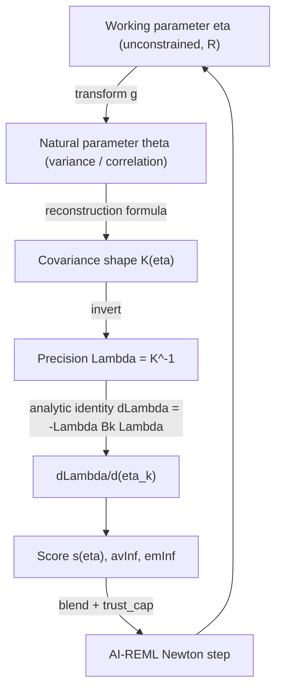

This vignette is written like a short book. Each chapter builds on the
previous one, and all chapters share the same notation so formulas can be
compared directly across chapters:

- $\theta$ : a **natural parameter** — a variance, a correlation, a range —
  the thing that has a real statistical meaning but also has to obey a rule
  (e.g. "must be positive").
- $\eta$ : a **working parameter** — the same information, but recoded so it
  is allowed to be *any* real number, with no rule to break.
- $g$ : the **transform** connecting them, $\theta = g(\eta)$.
- $K(\eta)$ : the (dimensionless) **covariance shape**, normalized so
  $K_{11}=1$.
- $\sigma^2$ : the single overall **scale**, owned by `vsm()`.
- $\Lambda = K^{-1}$ : the **precision** (inverse covariance shape).
- $B_k = \partial K/\partial \eta_k$ : the **structural derivative** of the
  shape with respect to working parameter $k$.

**Table of contents**

- Chapter 1: The linear mixed model and Henderson's equations
- Chapter 2: Parameterization theory, explained from first principles
- Chapter 3: Catalog of covariance structures
- Chapter 4: REML, AI-REML, and `ai_mme_sp2()`
- Chapter 5: Worked examples, one per structure
- Chapter 6: End-to-end numerical trace, from $\eta$ to the REML objective

\newpage

# Chapter 1: The linear mixed model and Henderson's equations

## 1.1 The model

```r
mmes(fixed = y ~ 1, random = ~ vsm(...), rcov = ~ vsm(...), data = ...)
```

fits

$$
y = X\beta + \sum_{i=1}^{r} Z_i u_i + e,
\qquad
u_i \sim N(0, G_i), \quad e \sim N(0, R)
$$

- $\beta$: fixed effects.
- $u_i$: random effects, one term per `random=~...` entry.
- $G_i = \mathrm{var}(u_i)$, $R = \mathrm{var}(e)$: the covariance matrices
  this whole vignette is about.

sommer never treats $G_i$ or $R$ as free unconstrained matrices. Every one
is built from a small number of variance components $\theta$ (Chapter 2),
and REML estimates $\theta$, not the matrix entries directly.

## 1.2 Henderson's Mixed Model Equations (MME)

Rather than maximizing the marginal likelihood of $y$ directly (which needs
$V = ZGZ' + R$, generally dense and huge), Henderson's equations solve for
$\beta,u$ jointly using only $R^{-1}$ and $G_i^{-1}$:

$$
C\begin{pmatrix}\hat\beta\\ \hat u\end{pmatrix}
=
\begin{pmatrix}X'R^{-1}y\\ Z'R^{-1}y\end{pmatrix},
\qquad
C =
\begin{pmatrix}
X'R^{-1}X & X'R^{-1}Z\\
Z'R^{-1}X & Z'R^{-1}Z + G^{-1}
\end{pmatrix}
$$

with $G^{-1} = \mathrm{blockdiag}(G_1^{-1}, \dots, G_r^{-1})$.

**Why this matters for parameterization:** every quantity sommer actually
needs — $C$, its log-determinant, and the REML score/AI-matrix — is built
from **inverses** ($R^{-1}$, $G_i^{-1}$) and their **derivatives with
respect to $\theta$**, never from $G_i$ or $R$ themselves except to invert
them once per structure per iteration. This is why sommer's internal name
for $G_i^{-1}$ within a structure is `Lambda` ($\Lambda = K^{-1}$).

## 1.3 Where covariance structures come in

For a random term built with `vsm(dsm(Env), usm(Trait), ism(Line))`, sommer
constructs

$$
G = \sigma^2 \cdot K_{dsm} \otimes K_{usm} \otimes K_{ism}
$$

- Exactly **one** free scale $\sigma^2$ per `vsm()` call (its `sigma2`
  argument).
- Every other factor (`dsm`, `usm`, `ism`, ...) supplies a **dimensionless
  shape** $K$ with $K_{11}=1$.

This separation of *scale* (one parameter, always variance-like) from
*shape* (any number of parameters, some variance-like, some
correlation-like) is the central design decision explored in the rest of
this vignette, and it directly determines how derivatives are computed in
`ai_mme_sp2()`.

## 1.4 Preview of the key distinction (developed in Chapter 4)

| | Variance-type parameter | Correlation-type parameter |
|---|---|---|
| Example | `sigma2`, `dsm()` ratios, `fam()` specific variances | `csm()`/`ar1m()` `rho`, `usm()`/`corgm()` off-diagonal terms |
| Effect on $K$ | rescales one or few diagonal blocks | reshapes the *entire* matrix jointly |
| $B_k=\partial K/\partial \eta_k$ | sparse / diagonal | dense |
| Average vs Expected Information | typically agree closely | can diverge — needs EM/AI blending |
| Practical consequence | fast trace/derivative shortcuts available | full dense chain-rule required |

\newpage

# Chapter 2: Parameterization theory, explained from first principles

## 2.1 Why we can't just let the computer search freely

Imagine you are tuning two dials for a model:

- Dial A controls a **variance**. It must always stay strictly positive —
  a "negative amount of variability" makes no sense.
- Dial B controls a **correlation**. It must always stay strictly between
  $-1$ and $1$ — a correlation of $2$ or $-3$ makes no sense either.

If you let an optimization algorithm (the computer's "hill-climbing"
procedure that tries to improve the fit step by step) move these dials by
any amount, in any direction, it will sooner or later try an illegal value:
a negative variance, or a correlation bigger than 1. At that point the model
is broken (the covariance matrix stops being a valid one — technically it
is no longer *positive definite*, which is the mathematical way of saying
"this could actually occur as a covariance of real data").

sommer's answer to this problem is always the same trick, used for every
single covariance structure in the package:

> Never let the optimizer touch the real dial ($\theta$). Instead, give it
> a **fake dial** ($\eta$) that can be turned all the way in either
> direction, forever, without ever breaking anything. Then use a fixed
> **recipe** ($g$) to translate the fake dial's position into a legal value
> of the real dial.

Formally: $\theta = g(\eta)$, where $\eta$ ranges over all real numbers
($-\infty$ to $\infty$) and $g$ is built so that $g(\eta)$ *always* lands in
the legal range for $\theta$, no matter what $\eta$ is.

This is exactly the same idea used elsewhere in statistics: for example,
when you model a probability (which must stay in $[0,1]$) with a logistic
regression, you don't optimize the probability directly — you optimize an
unconstrained "logit" score and convert it to a probability at the very end.
sommer does the same thing, systematically, for every variance and
correlation in every covariance structure it supports.

## 2.2 The working-parameter vector

In sommer's code, the collection of fake dials for one covariance structure
is called `par` (short for "working parameters"), and it always lives in
the `CovarianceFactor` descriptor returned by every constructor
(`csm()`, `ar1m()`, `usm()`, ...). Three related pieces travel together:

- `par` — the current numeric values of $\eta$.
- `free` — a logical flag per entry: is this $\eta_k$ estimated by REML, or
  is the user holding it fixed (`fixed=TRUE`)?
- `par_names` — a human-readable label per entry, e.g. `"rho"` or
  `"variance_ratio[B]"`, used when you call `summary()` on a fitted model.

REML (Chapter 4) works entirely with `par`/$\eta$. It never sees $\theta$
directly; $\theta = g(\eta)$ is only computed when sommer needs to actually
*build* the covariance matrix $K$, or when it reports results back to you in
a human-readable form.

## 2.3 Transform family 1 — variances: the exponential map

**The rule:** $\theta > 0$.

**The recipe:** $\theta = \exp(\eta) = e^{\eta}$.

Why this works: no matter what real number $\eta$ is — very negative, zero,
very positive — $e^\eta$ is *always* a positive number. As $\eta\to-\infty$,
$\theta\to 0$ (but never reaches it); as $\eta\to+\infty$, $\theta\to\infty$.
Every positive number is reachable by exactly one $\eta$ (the inverse recipe
is $\eta=\log(\theta)$).

A nice bonus: the "speed" at which $\theta$ changes as you nudge $\eta$
(its derivative, $\partial\theta/\partial\eta = e^\eta = \theta$) is
proportional to $\theta$ itself. This means equal steps in $\eta$-space are
equal-percentage steps in $\theta$-space (multiplicative, like moving up a
musical scale in octaves) rather than equal-amount steps — exactly the
natural way variances tend to move (a variance going from 1 to 2 "feels"
like the same size change as going from 10 to 20).

sommer almost never applies this to a *raw* variance, though. Instead it
applies it to a **ratio relative to a reference level** — this detail
matters because of scale confounding (see 2.6), so let's define it now
since you will see it in almost every structure in Chapter 3:

$$
\eta_j = \log\!\left(\frac{\theta_j}{\theta_1}\right), \quad j=2,\dots,q
$$

Level 1 is always the *reference*: $\theta_1$ is fixed at 1 by definition,
so only $q-1$ working parameters are needed to describe $q$ relative
variances.

## 2.4 Transform family 2 — bounded quantities: logit and tanh

**The rule:** $\theta \in (lo, hi)$, a bounded open interval — e.g. a
correlation $\rho\in(-1,1)$, or a compound-symmetry $\rho\in(-1/(q-1), 1)$.

**The recipe (general bounded interval):**

$$
\theta = lo + (hi-lo)\cdot s(\eta), \qquad
s(\eta) = \frac{1}{1+e^{-\eta}} \ \ (\text{the logistic/"sigmoid" function})
$$

The sigmoid function $s(\eta)$ is the same S-shaped curve used in logistic
regression: it always outputs a number strictly between 0 and 1, approaching
0 as $\eta\to-\infty$ and approaching 1 as $\eta\to+\infty$, and it is
smooth and increasing everywhere. Stretching and shifting its output
($lo + (hi-lo)\cdot s(\eta)$) maps it onto *any* open interval $(lo,hi)$
instead of just $(0,1)$.

**The recipe (symmetric interval $(-1,1)$):** when the bounds are exactly
$-1$ and $1$ (as for a plain correlation), sommer often uses the equivalent
but more compact hyperbolic tangent:

$$
\theta = \tanh(\eta) = \frac{e^{\eta}-e^{-\eta}}{e^{\eta}+e^{-\eta}}
$$

which is just the logit recipe above rescaled — same S-shape, same
guarantee ($\tanh(\eta)$ is always strictly between $-1$ and $1$), just
centered at 0 instead of at $1/2$.

**Why bother with a whole interval instead of just "positive," like
variances?** Because a correlation has *two* walls (an upper *and* a lower
limit), while a variance only has one (a floor at 0, no ceiling). The
sigmoid/tanh family is the natural tool whenever there are two walls to
respect simultaneously.

**A subtlety that matters in Chapter 4:** near the middle of the interval,
$s(\eta)$ changes quickly as $\eta$ moves — a small step in $\eta$ makes a
decent-sized change in $\theta$. But near the two walls (as $\eta$ gets very
large in either direction), $s(\eta)$ becomes almost flat: huge changes in
$\eta$ barely move $\theta$ at all. This is deliberate and useful — it means
that if REML tries to push a correlation toward its boundary, the working
scale automatically resists further movement (the "gas pedal" stops doing
much once you're already flooring it), rather than needing an artificial
rule bolted on afterward.

## 2.5 Transform family 3 — many correlated quantities at once (factorizations)

Families 1 and 2 work great for a single variance or a single correlation,
one dial at a time. But some structures have many correlations that all
have to be *jointly* consistent with each other — for example, an
unstructured $3\times 3$ correlation matrix has 3 pairwise correlations, but
not every combination of 3 numbers in $(-1,1)$ is a valid correlation
matrix (try $\rho_{12}=0.9,\ \rho_{13}=0.9,\ \rho_{23}=-0.9$ — no data set
can ever produce that).

So instead of transforming each correlation separately, sommer
reparameterizes the *whole matrix at once* through a **factorization** — a
recipe that builds the matrix out of simpler unconstrained ingredients in
such a way that the result is automatically valid, no matter what those
ingredients are. The two building blocks used throughout the package are:

- **Cholesky factor**: any covariance/correlation matrix $K$ can be written
  as $K = LL'$ for some lower-triangular matrix $L$ with positive diagonal.
  Conversely, *any* lower-triangular $L$ with positive diagonal, multiplied
  by its own transpose, automatically produces a valid (positive definite)
  $K = LL'$ — there is no combination of entries of $L$ that can break this.
  So sommer parameterizes $L$ instead of $K$: the off-diagonal entries of
  $L$ are unconstrained working parameters directly, and the diagonal
  entries of $L$ go through the family-1 exponential recipe (to keep them
  positive). Used by `usm()` (Chapter 3.7) and, restricted to unit-diagonal
  $L$, by `corgm()` (Chapter 3.8).
- **Loadings + diagonal ("factor-analytic") factor**: $K \propto \Lambda
  \Lambda' + \Psi$ for a rectangular loading matrix $\Lambda$ (any real
  numbers) and a diagonal matrix $\Psi$ with positive entries (again via the
  family-1 recipe). A sum of "something squared" ($\Lambda\Lambda'$, always
  positive semi-definite) and "something positive on the diagonal" ($\Psi$)
  is always positive definite — again, automatically, for *any* real
  $\Lambda$. Used by `fam()`/`rrcm()` (Chapter 3.9) and, in a
  triangular/banded variant, by `antem()` (Chapter 3.10).

**The common thread across all three families:** every recipe in this
chapter is a *one-way-safe* translation from "any real number(s) at all"
to "a legal $\theta$/$K$." This is why sommer's optimizer (Chapter 4) can
take a Newton step of any size, in any direction, in $\eta$-space, and
*never* produce an invalid model — the only thing that can still go wrong is
that the *fit* gets worse, which is a completely different (and much
easier to handle) problem than *breaking the math*.

## 2.6 Why the reference level matters: avoiding scale confounding

Recall from Chapter 1 that a `vsm()` term is a Kronecker product
$G = \sigma^2\cdot K_1\otimes K_2\otimes\cdots$. If every $K_i$ were allowed
to carry its own free overall scale (instead of being pinned to $K_{i,11}=1$
via a reference level), the model would have infinitely many
$(\sigma^2, K_1,K_2,\dots)$ combinations that produce the *exact same* $G$
— for instance doubling $\sigma^2$ while halving every entry of $K_1$
changes nothing observable. This is called **non-identifiability**: REML
would have no way to choose among the infinitely many equally-good answers,
and the optimizer would wander aimlessly or fail to converge.

sommer avoids this by a strict convention, applied without exception: every
covariance-shaping factor is normalized so its first diagonal entry is
exactly 1 ($K_{11}=1$), and the *one and only* free overall scale lives in
`vsm()`'s `sigma2` argument. This is why, throughout Chapter 3, you will see
"$\theta_1$ is the reference, fixed at 1" repeated for structure after
structure — it is not a coincidence, it is the mechanism that keeps the
whole model identifiable.

\newpage

# Chapter 3: Catalog of covariance structures

For each structure: the **shape formula** $K(\eta)$ (normalized so
$K_{11}=1$), the **working parameters** $\eta$ and their transform (from
Chapter 2), and whether it is fundamentally a *variance-type* or
*correlation/shape-type* parameterization (this label is used again in
Chapter 4 and in the matching worked example of Chapter 5).

## 3.1 `ism(x)` — identity

$$K = I_q, \qquad \text{no free parameters.}$$

Simplest possible shape: independent, homoscedastic levels. Used as the
"main effect" incidence in most `vsm()` calls, or as a Kronecker factor when
no structure is desired on one dimension.

## 3.2 `dsm(x, values, fixed, theta)` / `atm(x, levs, values, fixed)` — heterogeneous diagonal variances

$$
K = \mathrm{diag}(1, \theta_2/\theta_1, \dots, \theta_q/\theta_1),
\qquad \eta_j = \log(\theta_j/\theta_1),\ j=2,\dots,q
$$

Family-1 (exponential/log-ratio) transform, applied to every level except
the reference. Pure **variance-type** structure: $q-1$ free log-variance
ratios, no correlation at all (off-diagonal is exactly 0). `atm()` is the
same construction restricted to a user-selected subset of levels (`levs`);
unselected levels get zero columns in the design matrix and are excluded
from $\eta$.

## 3.3 `csm(x, rho, fixed, variance, values)` — compound symmetry

$$
K_{ii}=1,\quad K_{ij}=\rho\ (i\neq j), \qquad
lo=\frac{-1}{q-1} < \rho < 1
$$

Family-2 (bounded logit) transform: $\eta_\rho = \mathrm{logit}\!\left(
\frac{\rho-lo}{1-lo}\right)$.

- `variance="homogeneous"` (default): only $\eta_\rho$ is free — a single
  **correlation-type** parameter.
- `variance="heterogeneous"`: additionally appends $q-1$ family-1
  log-variance-ratios $\eta_j=\log(\theta_j/\theta_1)$, so
  $K=\mathrm{diag}(\sqrt\theta)\, R\, \mathrm{diag}(\sqrt\theta)$ with $R$
  the homogeneous compound-symmetric correlation. A **mixed**
  parameterization: 1 correlation-type + $(q-1)$ variance-type parameters.

## 3.4 `ar1m`/`ar2m`/`ar3m`/`toeplitzm` — autoregressive & general Toeplitz correlation

All parameterize an ordered correlation matrix through **partial
autocorrelations (PACF)** $\kappa\in(-1,1)^{order}$, family-2 (tanh)
transform $\eta=\mathrm{atanh}(\kappa)$, reconstructed to full correlations
$\rho_h$ (lag $h$) via the Durbin–Levinson recursion:

$$
K_{ij} = \rho_{|i-j|}
$$

- `ar1m()`: order 1, $\rho_h=\rho^h$ (the classical AR(1) correlation), 1
  correlation-type parameter.
- `ar2m()`/`ar3m()`: order 2/3, PACF vector of length 2/3 mapped through
  Durbin–Levinson to $\rho_h$ for all lags up to $q-1$.
- `toeplitzm()`: order $q-1$ (fully general stationary Toeplitz
  correlation, no autoregressive-order restriction) — the most flexible
  member of this family, still guaranteed valid for any PACF in
  $(-1,1)^{q-1}$ (this is exactly the joint-validity guarantee discussed in
  Chapter 2.5, achieved here through PACF rather than through a matrix
  factorization).
- All four support `variance = "heterogeneous"` (AR family only;
  `toeplitzm()` is shape-only) the same way as `csm()`: append $q-1$
  family-1 log-variance-ratios after the PACF working parameters.

## 3.5 `mam`/`ma1m`/`ma2m` — moving-average covariance

$$
K \propto \mathrm{Cov}\!\left(e_t + \theta_1 e_{t-1} + \theta_2 e_{t-2}\right)
$$

Working parameters are the **raw MA coefficients themselves**
($\eta=\theta$, no transform at all) — unlike AR, *any* finite MA
coefficients produce a valid covariance; invertibility of the MA polynomial
is not required to define the covariance matrix, so no bounding transform is
needed. This is the one "ordered" structure whose working parameter equals
its natural parameter directly. Purely a correlation/shape-type structure
(no variance option).

## 3.6 `corgm(x, theta, fixed)` — general correlation matrix

$$
K = AA', \qquad A \text{ unit-diagonal lower-triangular} \ (A_{ii}=1)
$$

Family-3 (factorization) transform: the strictly-lower-triangular entries
of $A$ are working parameters directly (no further per-entry transform is
needed — Chapter 2.5 explains why any real lower-triangular $A$ with unit
diagonal automatically gives a valid $K$). $q(q-1)/2$ purely
**correlation-type** parameters, no variance component at all (contrast
with `usm()` below, which also carries diagonal/variance information).

## 3.7 `usm(x, theta, fixed)` — general unstructured covariance

$$
K = LL', \qquad L \text{ lower-triangular}, L_{11}=1
$$

Family-3 (Cholesky factorization) transform: for each free entry of $L$
below the diagonal — the off-diagonal entries are working parameters
directly ($\eta=L_{ij}$), the diagonal entries go through the family-1
log transform ($\eta=\log L_{ii}$, keeping $L_{ii}>0$ hence $K$
nonsingular). Total $q(q+1)/2 - 1$ free parameters (the $-1$ is
$L_{11}=1$, fixed by the Chapter 2.6 reference-level convention).

This is the maximally flexible valid shape for $q$ levels — every possible
covariance shape is reachable, at the cost of $O(q^2)$ parameters. It mixes
**variance-type** (log-diagonal) and **correlation-type** (off-diagonal)
working parameters in a single structure.

## 3.8 `fam(x, k, loadings, specific, fixed)` / `rrcm(x, k, loadings, fixed)` — factor-analytic covariance

$$
M = \Lambda\Lambda' + \Psi, \qquad K = M / M_{11}
$$

Family-3 (loadings + diagonal) transform:

- $\Lambda$: $q\times k$ loadings, lower-triangular in its leading
  $k\times k$ block (for a unique, "rotationally identified" solution),
  diagonal entries family-1 log-parameterized (must be positive by
  convention), off-diagonal loadings unconstrained working parameters.
- $\Psi=\mathrm{diag}(\psi_1,\dots,\psi_q)$: specific variances,
  family-1 parameterized as $q-1$ log-ratios relative to $\psi_1$ (the
  reference level, per Chapter 2.6).

A rank-$k$ **correlation-type** structure (loadings) plus a genuinely
**variance-type** component (specific variances) — a compact alternative to
`usm()` when $q$ is large and a low-rank + diagonal approximation is
statistically reasonable (the standard "FA" model for many traits or many
environments). `rrcm()` is the same loading parameterization with
$\Psi=I$ fixed (a pure reduced-rank approximation, no free specific
variances) — purely correlation/shape-type.

## 3.9 `antem(x, order, beta, innovations, fixed)` — antedependence

$$
Ty = e,\quad \mathrm{Cov}(e)=D \text{ diagonal},\qquad
K = T^{-1} D T^{-T},\quad D_{11}=1
$$

$T$ is unit lower-triangular with **regression coefficients**
$\beta_{ij}$ only in the requested `order` subdiagonals (working parameters
= $\beta$ directly, unconstrained — a banded relative of the family-3
factorization idea). $D$'s remaining diagonal entries are $q-1$ family-1
log-innovation-ratios (variance-type). A mixed structure like `usm()` but
banded/order-limited rather than fully dense, useful for
longitudinal/repeated-measures data where dependence should decay with
temporal order but need not follow a strict AR form.

## 3.10 `maternm(x, range, nu, fixed, distance)` — Matérn spatial correlation

$$
K_{ij} = \frac{2^{1-\nu}}{\Gamma(\nu)}
\left(\frac{\sqrt{2\nu}\,d_{ij}}{r}\right)^{\!\nu}
K_\nu\!\left(\frac{\sqrt{2\nu}\,d_{ij}}{r}\right)
$$

Family-1 (log) transform on both parameters: $\eta = (\log r, \log \nu)$
(both must be positive: range and smoothness). Distance $d_{ij}$ comes from
supplied coordinates or a user-supplied distance matrix. Two
**correlation-type** (in the "shape" sense — they reshape the whole matrix,
not just rescale one entry) parameters governing decay rate and smoothness
of spatial dependence.

## 3.11 `sar(x, W, rho, fixed)` — simultaneous autoregressive spatial covariance

$$
B = I - \rho W, \qquad M = B^{-1}B^{-T}, \qquad K = M/M_{11}
$$

Family-2 (bounded logit) transform: $\rho$ bounded by the inverse spectral
radius of $W$ (guarantees $B$ nonsingular). One **correlation-type**
(shape) parameter that reshapes the entire spatial covariance through
matrix inversion.

## 3.12 `car(x, W, rho, fixed)` — proper conditional autoregressive covariance

$$
Q = D-\rho W,\quad D=\mathrm{diag}(\text{rowSums}(W)),\qquad
M=Q^{-1},\qquad K=M/M_{11}
$$

Family-2 (bounded logit) transform: $\rho$ bounded by the reciprocal extreme
eigenvalues of the normalized adjacency $S=D^{-1/2}WD^{-1/2}$ (the exact
condition for $Q$ to stay valid). Same flavor as `sar()`: one
correlation/shape-type parameter, whole-matrix reshaping via inversion.

## 3.13 `ownm(x, K, fun, par, fixed, dfun)` — user-defined shape

Either a fixed known valid matrix `K` (zero free parameters, sommer only
normalizes it by its $[1,1]$ entry), or a user function `fun(par)` returning
a valid matrix, normalized the same way. Here the user is responsible for
choosing their own transform family from Chapter 2 (or inventing a new one);
sommer only imposes the final $K_{11}=1$ normalization. If `dfun(par,k)`
(analytic $B_k=\partial K/\partial\eta_k$) is not supplied, `ai_mme_sp2()`
falls back to a numerical derivative. This is the escape hatch for any
structure not already covered — it plugs into the exact same
`CovarianceFactor` interface as `maternm()`/`toeplitzm()`/`sar()`/`car()`.

## 3.14 `covm(ran1, ran2, thetaC, theta, ...)` — legacy two-random-effect helper

Predates the general `vsm()` Kronecker interface; builds a
`CovarianceFactor` directly from two random-effect terms and an explicit
correlation-structure matrix `thetaC`/`theta`. Internally normalized and
compiled through the same descriptor contract as every structure above, so
it participates in REML identically once compiled — retained mainly for
backward compatibility with older model specifications.

## 3.15 Summary table

| Constructor | Free working parameters $\eta$ | Transform family (Ch. 2) | Type |
|---|---|---|---|
| `ism` | 0 | — | — |
| `dsm`/`atm` | $q-1$ | 1 (log-ratio) | variance |
| `csm` (homogeneous) | 1 (`rho`) | 2 (bounded logit) | correlation |
| `csm` (heterogeneous) | $1+(q-1)$ | 2 + 1 | mixed |
| `ar1m` | 1 (`rho`) | 2 (tanh) | correlation |
| `ar2m`/`ar3m` | 2 / 3 (PACF), +$(q-1)$ if heterogeneous | 2 (+1) | correlation / mixed |
| `toeplitzm` | $q-1$ (PACF) | 2 (tanh) | correlation |
| `mam`/`ma1m`/`ma2m` | order (1 or 2) | none (identity) | correlation |
| `usm` | $q(q+1)/2-1$ | 3 (Cholesky) + 1 (diag) | mixed (dense) |
| `corgm` | $q(q-1)/2$ | 3 (unit-diag factor) | correlation (dense) |
| `fam` | loadings ($k$-rank) + $(q-1)$ specific | 3 (loadings) + 1 | mixed |
| `rrcm` | loadings ($k$-rank) | 3 (loadings) | correlation |
| `antem` | banded regression coeffs + $(q-1)$ innovations | 3 (banded) + 1 | mixed |
| `maternm` | 2 (range, nu) | 1 (log) x2 | correlation (shape) |
| `sar`/`car` | 1 (`rho`) | 2 (bounded logit) | correlation (shape) |
| `ownm` | user-defined | user-defined | user-defined |

\newpage

# Chapter 4: REML, AI-REML, and `ai_mme_sp2()`

## 4.1 The REML log-likelihood sommer maximizes

For the Henderson system of Chapter 1, the (restricted) log-likelihood
`ai_mme_sp2()` evaluates every iteration is

$$
\ell(\eta) = -\tfrac12\Big(
\log|C| \;+\; \log|R| \;+\; \sum_i n_i\log|A_i| \;+\; y'Py
\Big)
$$

mapped directly onto the code:

- `logDetC` — $\log|C|$, from the sparse Cholesky/LDLT factorization of
  Henderson's $C$ matrix (or CHOLMOD/PCG-approximated for large sparse $C$).
- `logDetR` — $\log|R|$, computed per residual-structure branch (diagonal
  fast path, Kronecker-residual branch, or dense fallback).
- `logDetA(i)` — $-\log|A_i^{-1}|$ per random effect (relationship/precision
  matrices), via sparse LDLT.
- `yPy` — the quadratic form $y'Py$ from absorbing $y$ into the MME solve.

REML maximizes $\ell(\eta)$ over the **working parameters** $\eta$ from
Chapter 2 (not the natural parameters $\theta$), using a Newton-type
**Average-Information (AI) REML** algorithm.

## 4.2 The AI-REML update

$$
\eta^{(t+1)} = \eta^{(t)} + \mathrm{InfMat}^{-1}\, s(\eta^{(t)})
$$

- $s(\eta)$: the score vector, $\partial\ell/\partial\eta$.
- `InfMat`: a convex blend of the **Average Information** matrix (`avInf`)
  and the **Expected Information** matrix (`emInf`):

```cpp
InfMat = (weightAiInfMat * avInf) + (weightEmInfMat * emInf);
```

with per-iteration weights (`emweight`/`weightEmInf`, user/schedule
controlled) trading off AI-REML's fast quadratic convergence against
classical EM-REML's guaranteed monotone ascent and better global behavior
when the AI matrix is momentarily ill-conditioned. This blending is exactly
the mechanism that absorbs the numerical differences between variance-type
and correlation-type parameters described below — when the AI block for a
dense correlation structure is poorly conditioned, increasing the EM weight
locally stabilizes the step without touching the well-behaved variance
blocks.

## 4.3 The core object: precision and its derivative

For a covariance shape $K(\eta)$, sommer works with its inverse (precision)
$\Lambda = K^{-1}$ (`lambdaDense` in `ai_mme_sp2()`). All REML derivatives
route through the standard matrix-inverse identity:

$$
\frac{\partial \Lambda}{\partial \eta_k}
= -\Lambda B_k \Lambda, \qquad B_k = \frac{\partial K}{\partial \eta_k}
$$

implemented essentially verbatim:

```cpp
arma::mat dLambda = -lambdaDense * Bk * lambdaDense;   // Bk = dK/d(eta_k)
dLambda = 0.5 * (dLambda + dLambda.t());               // symmetrize (roundoff)
```

`Bk` (called `cachedCovarianceD1()`/`covarianceD1()` in the code) is where
**every** structure-specific formula from Chapter 3 actually enters the
optimizer — for analytic structures (diag, AR, CSM, US, ...) it's a
closed-form matrix; for generic-interface structures (`maternm`,
`toeplitzm`, `sar`, `car`, `ownm` without `dfun`) it's a numerical
derivative of the R-level `evaluator` function. Either way, from this point
on `ai_mme_sp2()` treats `Bk` identically regardless of structure — **the
only thing that changes the downstream numerics is what `Bk` looks like**,
which is precisely the variance-vs-correlation distinction below.

## 4.4 Variance-type parameters: sparse/diagonal $B_k$

For a pure variance-ratio working parameter (e.g. `dsm()`'s
$\eta_j=\log(\theta_j/\theta_1)$, or `vsm()`'s own outer `sigma2`):

$$
K = \mathrm{diag}(1,\theta_2/\theta_1,\dots),\qquad
B_j = \frac{\partial K}{\partial \eta_j} = \theta_j/\theta_1 \cdot e_j e_j'
$$

$B_k$ is **rank-one and diagonal** — a single nonzero entry. Consequences:

- $\mathrm{d}\Lambda_k = -\Lambda B_k \Lambda$ collapses to a rank-one
  update restricted to row/column $j$: cheap to form, cheap to multiply
  against other quantities.
- The **trace terms** needed for the score and for `avInf`/`emInf`
  (generically $\mathrm{tr}(P\,\mathrm{d}C_k)$ and
  $\mathrm{tr}(P\,\mathrm{d}C_i\,P\,\mathrm{d}C_j)$) reduce to a small
  number of scalar row/column contractions instead of full dense matrix
  products — this is exactly the "diagonal residual fast path"
  specialization used for pure-variance residual structures, which only
  exists because the *derivative* itself is diagonal, not because the
  covariance is diagonal per se.
- For the single overall `sigma2` in `vsm()`, $\partial G/\partial\sigma^2 =
  K$ exactly (the whole shape, undifferentiated) — the classical textbook
  variance-component REML derivative. This is the parameter for which
  **Average Information and Expected Information coincide most closely** in
  well-behaved models, which is part of why classical variance-components
  REML (pre-AI, EM-only) worked well for decades on models built purely
  from `ism()`/`dsm()`-type structures.

## 4.5 Correlation-type parameters: dense $B_k$

For a correlation/shape working parameter (e.g. `csm()`'s
$\eta_\rho=\mathrm{logit}(\cdot)$, `ar1m()`'s $\eta=\mathrm{atanh}(\rho)$,
`usm()`/`corgm()`'s Cholesky-factor entries):

$$
\frac{\partial K}{\partial \eta_\rho}
= \frac{\partial K}{\partial \rho}\cdot\frac{\partial \rho}{\partial \eta_\rho}
$$

Both factors are **dense in general**: changing a single correlation
parameter perturbs *every* off-diagonal entry of $K$ simultaneously (e.g.
for `ar1m()`, $K_{ij}=\rho^{|i-j|}$ so $\partial K_{ij}/\partial\rho =
|i-j|\,\rho^{|i-j|-1}$ is nonzero for every $i\neq j$). Consequences:

- $B_k$ is a full $q\times q$ matrix with no exploitable sparsity in
  general (compound symmetry and AR have some exploitable *structure*, but
  not the sparsity a diagonal derivative gives).
- $\mathrm{d}\Lambda_k=-\Lambda B_k\Lambda$ is a genuinely dense matrix
  product, $O(q^3)$ per parameter per iteration — no shortcut analogous to
  the diagonal case.
- The chain-rule factor $\partial\rho/\partial\eta_\rho$ (derivative of the
  logit-inverse or $\tanh$ from Chapter 2.4) is itself **not constant**: for
  the bounded-logit map, $\partial\rho/\partial\eta = (1-lo)\cdot s(1-s)$
  where $s=\mathrm{logit}^{-1}(\eta)$, which **vanishes as
  $\eta\to\pm\infty$** (i.e. as $\rho$ approaches its boundary). This is the
  same "flattening near the walls" property described in Chapter 2.4 — it
  naturally damps REML steps that would otherwise push $\rho$ against its
  feasible limit — but it also means the **information matrix entries for
  correlation parameters shrink near the boundary**, unlike variance
  parameters, whose exponential-family Jacobian never vanishes (only
  grows as $\theta$ grows).
- Because dense $B_k$ products couple every pair $(i,k)$ of structure
  parameters through $\mathrm{tr}(P\,\mathrm{d}C_i\,P\,\mathrm{d}C_j)$, the
  resulting `avInf` block for correlation parameters is **fully dense and
  more prone to near-singularity** (e.g. when a correlation parameter is
  weakly identified, or two correlation parameters trade off against each
  other, as in `usm()` with many levels and modest sample size) — this is
  precisely the situation the EM/AI blending in Section 4.2 exists to
  stabilize: `emInf` (expected information) is guaranteed valid and
  typically better conditioned than `avInf` in these dense/boundary-adjacent
  regimes, so increasing its weight recovers a well-defined,
  descent-guaranteeing step even when `avInf` alone would not.

## 4.6 `trust_cap`: a second REML-stability mechanism tied to parameter type

Independent of AI/EM blending, `ai_mme_sp2()` also enforces a per-parameter
**trust-region cap** (`trust_cap` in each `CovarianceFactor`) that bounds
how far a single working parameter may move in one iteration:

```cpp
arma::vec caps = Rcpp::as<arma::vec>(f["trust_cap"]);
```

- Variance-type parameters (unbounded exponential map) are typically given
  a **larger** cap — `sigma2`-like parameters can safely take large
  multiplicative steps early in REML with little risk of overshoot causing
  invalidity — only the likelihood itself, not validity, is at stake.
- Correlation-type / bounded-map parameters (e.g. `maternm()`'s range/nu use
  `c(1.0, 0.75)`, `sar()`/`car()` use `1.0`) are given **tighter** caps,
  because a large step on the working scale, pushed through a saturating
  transform (logit/tanh), can still correspond to a *huge* change in the
  reconstructed matrix's conditioning even though the value itself stays
  valid — the cap prevents a technically-valid but wildly-overshooting
  proposal from destabilizing the next likelihood evaluation.

This is a purely numerical safeguard layered on top of the
always-valid-by-construction guarantee from Chapter 2 — validity is never
at risk, but *good conditioning* and *monotone likelihood ascent* are, and
they are protected differently for the two parameter families.

## 4.7 Summary: the full chain per parameter type



| Stage | Variance-type parameter | Correlation-type parameter |
|---|---|---|
| Transform (Ch. 2) | family 1: exponential (unbounded above) | family 2/3: logit/tanh/factorization (saturating, bounded) |
| $B_k = \partial K/\partial \eta_k$ | sparse/diagonal, rank-1 | dense, full matrix |
| Cost of $\mathrm{d}\Lambda_k$ | cheap (structured update) | $O(q^3)$ dense product |
| avInf conditioning | usually well-behaved | can be near-singular, especially near boundary or weak identifiability |
| EM/AI blend role | rarely needed | often needed for stability |
| `trust_cap` | looser | tighter |

This is the concrete, code-level answer to "how does the REML process
differ between a variance parameter and a correlation parameter": both are
optimized by the *same* AI-REML machinery over unconstrained working
parameters (Chapter 2), but the **structure of their derivative** ($B_k$,
hence $\mathrm{d}\Lambda_k$, hence the AI/EM information blocks) is
fundamentally sparser and better-conditioned for variance parameters than
for correlation parameters, which is why sommer layers EM/AI blending and
per-parameter trust caps on top of a uniform derivative framework rather
than hard-coding structure-specific optimizers.

\newpage

# Chapter 5: Worked examples, one per structure

Every example below reuses the exact notation from Chapter 2 ($\theta$,
$\eta$, $g$, $K$, $\sigma^2$, $\Lambda$, $B_k$) so you can trace each
structure's entry in Chapter 3 all the way to a concrete number.

## 5.1 `ism()`

$q=2$ levels, no working parameters at all: $K=I_2=\begin{pmatrix}1&0\\0&1
\end{pmatrix}$, $\Lambda = K^{-1} = I_2$. There is no $\eta$ to iterate on
for this factor — it contributes only through the Kronecker product with
the other factors in the same `vsm()` term.

## 5.2 `dsm()`

$q=3$ levels, natural variances $\theta=(1, 2.25, 0.81)$ (already showing
$\theta_1=1$, the reference from Chapter 2.6). Family-1 transform:

$$
\eta_2=\log(2.25/1)=0.8109,\qquad \eta_3=\log(0.81/1)=-0.2107
$$

$$
K=\mathrm{diag}(1,\ 2.25,\ 0.81),\qquad
\Lambda = K^{-1} = \mathrm{diag}(1,\ 0.4444,\ 1.2346)
$$

Structural derivative for $\eta_2$: $B_2 = \partial K/\partial \eta_2 =
2.25\cdot e_2e_2' = \mathrm{diag}(0,2.25,0)$ — a single nonzero entry, the
sparse/diagonal pattern of Chapter 4.4.

## 5.3 `csm()`, homogeneous

$q=3$, $lo=-1/(q-1)=-0.5$. Suppose $\rho=0.4$. Family-2 transform:

$$
p=\frac{\rho-lo}{1-lo}=\frac{0.4+0.5}{1.5}=0.6,\qquad
\eta_\rho=\mathrm{logit}(0.6)=\log\frac{0.6}{0.4}=0.4055
$$

$$
K=\begin{pmatrix}1&0.4&0.4\\0.4&1&0.4\\0.4&0.4&1\end{pmatrix}
$$

$B_1=\partial K/\partial\eta_\rho$ is dense (every off-diagonal entry
moves together) — matching Chapter 4.5's correlation-type pattern.

## 5.4 `csm()`, heterogeneous

Same $\rho=0.4$ ($\eta_\rho=0.4055$), plus variances
$\theta=(1,\ 1.5,\ 0.6)$ giving $\eta_2=\log(1.5)=0.4055$,
$\eta_3=\log(0.6)=-0.5108$ (family-1, exactly as in 5.2). Full working
vector: $\eta=(0.4055,\ 0.4055,\ -0.5108)$ — 1 correlation-type entry
followed by 2 variance-type entries, the "mixed" row of the Chapter 3.15
table.

## 5.5 `ar1m()`

$q=4$, $\rho=0.5$. Family-2 (tanh) transform: $\eta=\mathrm{atanh}(0.5)=
0.5493$.

$$
K=\begin{pmatrix}
1 & 0.5 & 0.25 & 0.125\\
0.5 & 1 & 0.5 & 0.25\\
0.25 & 0.5 & 1 & 0.5\\
0.125 & 0.25 & 0.5 & 1
\end{pmatrix}
$$

$K_{ij}=\rho^{|i-j|}$; the single working parameter reshapes every
off-diagonal band simultaneously (dense $B_1$, Chapter 4.5).

## 5.6 `ar2m()` / `ar3m()` / `toeplitzm()`

$q=4$, order-2 PACF $\kappa=(0.3,-0.2)$. Family-2 transform:
$\eta=(\mathrm{atanh}(0.3), \mathrm{atanh}(-0.2)) = (0.3095,\ -0.2027)$. The
Durbin–Levinson recursion (Chapter 3.4) turns $\kappa$ into full lag
correlations $\rho_1,\rho_2,\rho_3$, which then fill $K_{ij}=\rho_{|i-j|}$
exactly like `ar1m()` above but allowing a richer decay pattern.
`toeplitzm()` with $q=4$ would use 3 PACF values (one per lag up to $q-1$)
instead of being capped at a fixed AR order.

## 5.7 `mam()` / `ma1m()` / `ma2m()`

$q=3$, order 1, $\theta_1=0.3$ (the raw MA coefficient — recall from
Chapter 3.5 there is **no transform**, so $\eta=\theta=0.3$ directly). The
resulting $K$ is built from
$\mathrm{Cov}(e_t+\theta_1 e_{t-1})$, giving a banded correlation matrix
with only lag-1 correlation nonzero. Because $g$ is the identity map here,
$B_1=\partial K/\partial\eta_1 = \partial K/\partial\theta_1$ directly — no
chain rule factor to track, unlike every bounded/positive structure above.

## 5.8 `usm()`

$q=2$ (the case from the original single-structure example, reproduced here
in the shared notation). Working parameters
$\eta=(\eta_{21},\ \eta_{22})=(0.30,\ \log(0.95))$, i.e.
$L_{21}=0.30$ (family-3, off-diagonal, no transform) and
$L_{22}=\exp(\eta_{22})=0.95$ (family-3 diagonal, family-1 log transform):

$$
L=\begin{pmatrix}1&0\\0.30&0.95\end{pmatrix},\qquad
K=LL'=\begin{pmatrix}1.0000&0.3000\\0.3000&0.9925\end{pmatrix}
$$

$$
\Lambda=K^{-1}=\frac{1}{|K|}\begin{pmatrix}K_{22}&-K_{12}\\-K_{12}&K_{11}
\end{pmatrix},\qquad |K|=0.9025
$$

$$
\Lambda\approx\begin{pmatrix}1.0997&-0.3325\\-0.3325&1.1080\end{pmatrix}
$$

Structural derivatives ($B_1=\partial K/\partial\eta_{21}$,
$B_2=\partial K/\partial\eta_{22}$, chain rule
$\partial K/\partial\eta_{22} = \partial K/\partial L_{22}\cdot L_{22}$
since $L_{22}=\exp(\eta_{22})$):

$$
B_1=\begin{pmatrix}0&1\\1&0.60\end{pmatrix},\qquad
B_2=\begin{pmatrix}0&0\\0&1.805\end{pmatrix}
$$

$B_1$ (off-diagonal, correlation-type) is dense; $B_2$ (log-diagonal,
variance-type in flavor) is sparse/rank-one — Chapter 4.4/4.5's pattern,
both appearing inside the *same* structure.

## 5.9 `corgm()`

$q=3$, unit-diagonal lower factor entries $A_{21}=0.2$, $A_{31}=0.1$,
$A_{32}=0.15$ (family-3, no per-entry transform — any real numbers here
give a valid unit-diagonal $K$):

$$
A=\begin{pmatrix}1&0&0\\0.2&\sqrt{1-0.2^2}&0\\0.1&\ (\dots)&(\dots)
\end{pmatrix}
$$

(rows are renormalized to unit length internally so $K_{ii}=1$ exactly);
working parameters are simply $\eta=(0.2,\ 0.1,\ 0.15)$, i.e. `par` equals
the lower-triangular entries directly, with no chain-rule factor to apply
when differentiating $K$ with respect to $\eta$.

## 5.10 `fam()` / `rrcm()`

$q=3$, rank $k=1$. Loadings $\Lambda=(0.6,\ 0.4,\ 0.2)'$ (with the leading
entry $\Lambda_{11}=0.6>0$ log-parameterized:
$\eta_{load,1}=\log(0.6)=-0.5108$; the remaining loadings unconstrained:
$\eta_{load,2}=0.4$, $\eta_{load,3}=0.2$), specific variances
$\psi=(1,\ 0.5,\ 0.3)$ (family-1 log-ratio on levels 2-3:
$\eta_{spec,2}=\log(0.5)=-0.6931$, $\eta_{spec,3}=\log(0.3)=-1.2040$):

$$
M=\Lambda\Lambda'+\Psi=
\begin{pmatrix}0.36+1&0.24&0.12\\0.24&0.16+0.5&0.08\\0.12&0.08&0.04+0.3
\end{pmatrix},
\qquad K=M/M_{11}
$$

`rrcm()` would drop the $\psi$ working parameters entirely (fixing
$\Psi=I$) and keep only the loading parameters $\eta_{load}$.

## 5.11 `antem()`

$q=3$, order 1. Regression coefficients on the first subdiagonal only,
$\beta_{21}=0.4$, $\beta_{32}=0.3$ (unconstrained, $\eta=\beta$ directly —
same "no per-entry transform" logic as `corgm()`'s off-diagonal factor
entries), innovations $D=\mathrm{diag}(1,\ 0.7,\ 0.5)$ (family-1 log-ratio:
$\eta_{D,2}=\log(0.7)=-0.3567$, $\eta_{D,3}=\log(0.5)=-0.6931$):

$$
T=\begin{pmatrix}1&0&0\\-0.4&1&0\\0&-0.3&1\end{pmatrix},\qquad
K=T^{-1}DT^{-T}\ /\ (T^{-1}DT^{-T})_{11}
$$

## 5.12 `maternm()`

$q=3$ spatial points, distances $d_{12}=1,\ d_{13}=2,\ d_{23}=1$. Suppose
$r=1.5$, $\nu=0.5$ (Matérn with $\nu=0.5$ reduces to the exponential
correlation $K_{ij}=\exp(-d_{ij}/r)$). Family-1 transform on both:
$\eta=(\log 1.5,\ \log 0.5)=(0.4055,\ -0.6931)$.

$$
K_{12}=e^{-1/1.5}=0.5134,\quad K_{13}=e^{-2/1.5}=0.2636,\quad
K_{23}=e^{-1/1.5}=0.5134
$$

Both working parameters are correlation/shape-type: changing either $r$ or
$\nu$ reshapes every pairwise entry of $K$ at once (dense $B_k$, as in
Chapter 4.5).

## 5.13 `sar()`

$q=3$ areal units, adjacency $W$ with spectral radius (largest eigenvalue
magnitude) $=2$, so the valid range is $\rho\in(-0.5,0.5)$. Suppose
$\rho=0.2$. Family-2 (symmetric bounded logit) transform:

$$
p=\frac{\rho+0.5}{1.0}=0.7,\qquad \eta=\mathrm{logit}(0.7)=0.8473
$$

$$
K = M/M_{11},\qquad M=(I-0.2W)^{-1}(I-0.2W)^{-T}
$$

## 5.14 `car()`

$q=3$ areal units, symmetric non-negative adjacency $W$, row sums
$D=\mathrm{diag}(3,2,2)$. Suppose the valid range works out to
$\rho\in(-1.2,\ 1.0)$ and $\rho=0.3$. Family-2 transform:

$$
p=\frac{0.3+1.2}{2.2}=0.6818,\qquad \eta=\mathrm{logit}(0.6818)=0.7677
$$

$$
K = M/M_{11},\qquad M = (D-0.3W)^{-1}
$$

## 5.15 `ownm()`

A user supplies `fun <- function(par) matrix(c(1, par[1], par[1], 1), 2, 2)`
with `par=c(0.25)` — here the user has *chosen* to reuse the family-2
(bounded) idea manually by ensuring `par[1]` always stays in $(-1,1)$ some
other way (sommer does not enforce this for `ownm()`); $\eta=\theta=0.25$
directly, sommer only performs the $K_{11}=1$ normalization from Chapter
2.6 and, since no `dfun` was supplied, computes $B_1$ by a numerical
(finite-difference) derivative of `fun`.

\newpage

# Chapter 6: End-to-end numerical trace, from $\eta$ to the REML objective

Chapters 2-5 showed *how* a working parameter $\eta$ turns into a shape $K$
and a precision $\Lambda$. This chapter shows *where in the computation*
those numbers actually get used, by carrying one tiny, fully-numeric example
all the way from $\eta$ to the REML log-likelihood $\ell(\eta)$ itself —
reusing the exact `usm()` numbers from Section 5.8.

## 6.1 A 4-observation, 2-line x 2-trait toy data set

Two lines ($L_1,L_2$), two traits ($A,B$), one observation per
line-trait combination, model $y=\mathbf{1}\beta + u + e$ (a single fixed
intercept $\beta$, one random effect per line-trait cell, and residual
noise). Take the random-effect design as `vsm(usm(Trait), ism(Line))`,
which makes each line's 2-vector of trait effects
$u_{l}=(u_{l,A},u_{l,B})$ independent across lines with common covariance
$\sigma^2 K$:

$$
y = \begin{pmatrix}10\\12\\8\\9\end{pmatrix}\ \ (\text{order: } L_1A,\ L_1B,\ L_2A,\ L_2B),
\qquad X=\begin{pmatrix}1\\1\\1\\1\end{pmatrix},\qquad Z=I_4,\qquad R=I_4
$$

To isolate exactly what the *shape* working parameters do, fix the scale at
$\sigma^2=1$ and the residual variance at $1$ (in a real `mmes()` fit these
would be extra variance-type working parameters of their own, following
Section 4.4).

## 6.2 Step 1 — working parameters to the shape and its precision (Chapter 2-3)

Exactly the Section 5.8 `usm()` example: $\eta=(\eta_{21},\eta_{22}) =
(0.30,\ \log 0.95)$, so $L_{21}=0.30$, $L_{22}=0.95$, and

$$
K=\begin{pmatrix}1.0000&0.3000\\0.3000&0.9925\end{pmatrix},
\qquad
\Lambda=K^{-1}=\begin{pmatrix}1.0997&-0.3324\\-0.3324&1.1080\end{pmatrix}
$$

## 6.3 Step 2 — precision to Henderson's $C$ matrix (Chapter 1)

Because lines are independent (`ism(Line)`), the random-effect precision
$G^{-1}=\sigma^{-2}\,(I_2\otimes\Lambda)$ is block-diagonal, one copy of
$\Lambda$ per line — this is literally the only place $\eta$ enters the
whole computation; every quantity from here on is arithmetic built on top of
these four numbers. Henderson's $C$ (Section 1.2), with $R=I_4$ so
$Z'R^{-1}Z=I_4$:

$$
C=\begin{pmatrix}
4 & 1&1&1&1\\
1 & 2.0997&-0.3324&0&0\\
1 & -0.3324&2.1080&0&0\\
1 & 0&0&2.0997&-0.3324\\
1 & 0&0&-0.3324&2.1080
\end{pmatrix}
$$

rows/columns ordered $(\beta,\,u_{L_1A},\,u_{L_1B},\,u_{L_2A},\,u_{L_2B})$.
The $\Lambda$ blocks sit exactly where $Z'R^{-1}Z$ would otherwise be left
alone — $\eta$'s only job, computationally, is to determine these four
numbers added into $C$.

## 6.4 Step 3 — solving the MME (BLUEs/BLUPs depend on $\eta$)

Solving $C\,(\hat\beta,\hat u)' = (X'R^{-1}y,\ Z'R^{-1}y)' = (39,\,10,\,12,\,8,\,9)'$
gives

$$
\hat\beta \approx 9.752,\quad
\hat u_{L_1A}\approx 0.294,\ \hat u_{L_1B}\approx 1.113,\quad
\hat u_{L_2A}\approx -0.914,\ \hat u_{L_2B}\approx -0.501
$$

If $\eta$ had been different, $\Lambda$ would differ, the four numbers
inserted in Section 6.3 would differ, and **every one of these five
solutions would come out different** — this is the concrete meaning of
"the BLUPs/BLUEs depend on the covariance parameters."

## 6.5 Step 4 — from the MME solution to the REML ingredients (Chapter 4.1)

Using the identity $y'Py = y'R^{-1}y - (X'R^{-1}y,\,Z'R^{-1}y)\cdot(\hat\beta,\hat u)$:

$$
y'R^{-1}y = 10^2+12^2+8^2+9^2 = 389,
\qquad
y'Py \approx 389 - 384.81 \approx 4.19
$$

and, from the same $C$ matrix of Section 6.3 (a block-determinant
calculation, done in practice by sparse Cholesky, not shown here step by
step),

$$
\log|C| \approx 3.48
$$

With `ism(Line)` contributing $\log|A^{-1}|=0$ and $R=I_4$ contributing
$\log|R|=0$, Chapter 4.1's REML log-likelihood becomes a single concrete
number:

$$
\ell(\eta) = -\tfrac12\big(\log|C| + \log|R| + \textstyle\sum_i n_i\log|A_i| + y'Py\big)
\approx -\tfrac12(3.48+0+0+4.19) \approx -3.83
$$

**This is the number AI-REML is trying to make as large as possible**, and
every term in it was produced starting from the two numbers in $\eta$.

## 6.6 Step 5 — perturbing $\eta$: where the score/AI-matrix machinery lives

Section 4.3 gives the analytic derivative
$\partial\Lambda/\partial\eta_k = -\Lambda B_k\Lambda$. We can check this
numerically instead of trusting the formula blindly, using the same finite-
difference idea a high-school calculus class would use for any derivative:
nudge $\eta_{21}$ from $0.30$ to $0.31$ (holding $\eta_{22}$ fixed), rebuild
$K$ and $\Lambda$ exactly as in Section 6.2, and see how much $\Lambda$
moved.

Nudged value: $L_{21}=0.31,\ L_{22}=0.95$, giving
$K_{22}=0.31^2+0.95^2=0.9986$ (note $\det K = (L_{11}L_{22})^2=0.9025$ is
*unchanged*, since only the off-diagonal $\eta_{21}$ moved) and

$$
\Lambda_{\text{nudged}} \approx
\begin{pmatrix}1.1064&-0.3435\\-0.3435&1.1080\end{pmatrix}
$$

Finite-difference estimate of the derivative:

$$
\frac{\Lambda_{\text{nudged}}-\Lambda}{0.01} \approx
\begin{pmatrix}0.668&-1.108\\-1.108&0.000\end{pmatrix}
$$

Compare this to the *analytic* formula from Section 4.3/5.8,
$B_1=\partial K/\partial\eta_{21}=\begin{pmatrix}0&1\\1&0.60\end{pmatrix}$,
plugged into $-\Lambda B_1 \Lambda$:

$$
-\Lambda B_1 \Lambda \approx
\begin{pmatrix}0.665&-1.108\\-1.108&0.000\end{pmatrix}
$$

The two match (up to the expected finite-step-size rounding). This is
exactly the object `ai_mme_sp2()` forms internally as `dLambda` (Section
4.3), and it is what turns into the score $s(\eta)$ and the `avInf`/`emInf`
blocks of Section 4.2 that decide the *next* value of $\eta$ — closing the
loop: $\eta \to K \to \Lambda \to C \to (\hat\beta,\hat u) \to \ell(\eta)$
for the forward pass (Sections 6.2-6.5), and
$\eta \to B_k \to \mathrm{d}\Lambda_k \to s(\eta),\,\mathrm{InfMat}
\to \eta^{(t+1)}$ for the update that drives REML to convergence (Chapter
4.2).

\newpage

# Where to go from here

- To fit a model with any of these structures, see `?vsm` and the
  constructor's own help page (e.g. `?csm`, `?ar1m`, `?usm`).
- For the descriptor-level API details (fields of a `CovarianceFactor`,
  `free`, `par_names`, `trust_cap`), see `using-covariance-structures.Rmd`.
- For a deeper look at the specific performance optimizations inside
  `ai_mme_sp2()` referenced in Chapter 4 (sparse LDLT, CHOLMOD, PCG,
  selected-inverse traces), see the package's C++ source comments in
  `src/MNR.cpp`.
